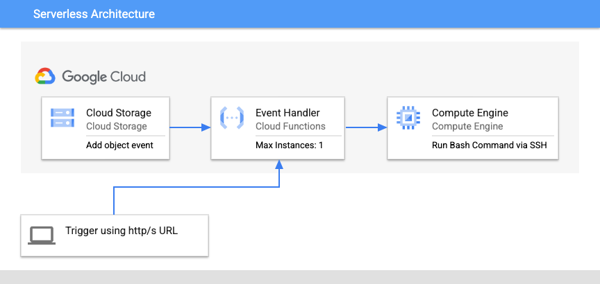

# GCE-SSH-CloudFunction



This repo holds the Python Code based on [tutorial on ssh to a Compute Engine VM](https://cloud.google.com/compute/docs/tutorials/service-account-ssh) that can be used to ssh to a Google Compute Engine VM via CloudFunction and execute the commands based on an event driven triggers.


## Steps to Configure CloudFunction

1. Clone the `Git Project` (Preferably on [Cloud Shell Terminal](https://cloud.google.com/shell))

    <pre>
    git clone https://github.com/skpathak2/GCE-SSH-CloudFunction.git
    </pre>

2. Navigate to `cloudFunSSH.py` and Update the Following `variables` in the `cloudFunSSH.py`
    ```
    vim cloudFunSSH.py

    main("<bash command>", "<project>", hostname="<public/privateIP>")
    ```

    Example Below
    ```
    main("sudo gsutil cp -r gs://my-bucket .", "my-sandbox", hostname="34.13.04.12")
    ```

> Note:- It is recommended to [Configure Serverless VPC Access](https://cloud.google.com/vpc/docs/configure-serverless-vpc-access) to access the VPC resources (In this case GCE VM's private interface) via private ip.

3. Create a `CloudFunction` using following parameter
```
Runtime : Python 3.9 
Entry point : gce_ssh
Copy the code from cloudFunSSH.py to Main.py
Update the requirements.txt as per the file in this repo
```

4. As per your use case please select a trigger and manage the event in your cloud function code.


## Trigger CloudFunction using Https url via code

To understand how to handel the events emitted due to https trigger of CloudFunction See the [HTTP function tutorial](https://cloud.google.com/functions/docs/tutorials/http) for an example of writing, deploying, and calling an HTTP function. 

Also please read [Authenticating for invocation](https://cloud.google.com/functions/docs/securing/authenticating). 

Basically To get your credentials use the Google Auth Client library. If you are testing from local you should create a service account JSON and load it to the environment variable GOOGLE_APPLICATION_CREDENTIALS

Which can be passed as a header while making the call to cloudFunction detailed below in the boiler plate code

```
 auth_req = google.auth.transport.requests.Request()
auth_token = google.oauth2.id_token.fetch_id_token(auth_req, cloud_function_url)

response = requests.post(cloud_function_url, json=payload, headers={"Authorization" : f"Bearer {auth_token}"})
```


